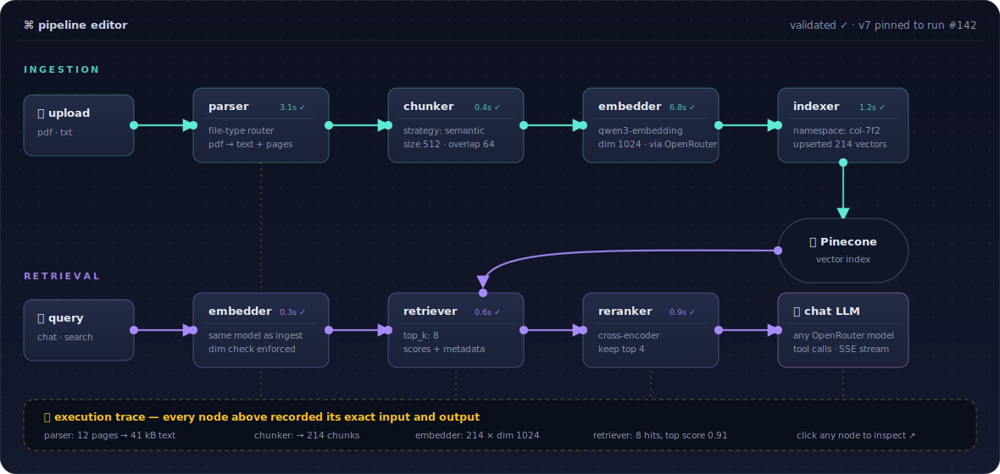

<div align="center">

# 🔍 TransparentRAG

### The RAG platform with nothing to hide.

**Build retrieval pipelines you can actually see — every parse, chunk, embedding, and retrieval step is a node on a graph you can inspect, trace, and rewire.**

[](https://github.com/Neeeser/TransparentRag/actions/workflows/ci.yml)
[](LICENSE)
[](https://fastapi.tiangolo.com/)
[](https://nextjs.org/)
[](https://www.python.org/)
[](https://www.typescriptlang.org/)
[](https://mypy-lang.org/)
[](#quality)
[](https://www.pinecone.io/)
[](https://openrouter.ai/)

[Why](#-why-transparentrag) · [Features](#-features) · [How it works](#-how-it-works) · [Quick start](#-quick-start) · [Roadmap](#-roadmap) · [Development](docs/DEVELOPMENT.md)

</div>

---

## 💡 Why TransparentRAG?

Most RAG stacks are black boxes. You upload a document, ask a question, get an answer — and when the answer is wrong, you have no idea *where* it went wrong. Was the PDF parsed badly? Did the chunker split a table in half? Did retrieval pull the wrong passages? Did the model just ignore them?

**TransparentRAG makes every step of the pipeline a first-class, inspectable object:**

- Your ingestion and retrieval pipelines are **editable node graphs**, not hardcoded plumbing.
- Every run records a **full execution trace** — the exact input and output of every node.
- Every chat answer shows its work: the tool calls it made, the chunks it retrieved, the scores, the tokens, the provider.

When something goes wrong, you don't guess. You open the trace, find the node that misbehaved, fix its config, and re-run.

## ✨ Features

### 🧩 Visual pipeline editor
Ingestion and retrieval are user-editable graphs built from typed nodes — parser, file-type router, chunkers (token / sentence / paragraph / semantic), embedder, vector indexer, retriever, reranker, chat settings. Ports are type-checked; the validator catches dimension mismatches, dangling edges, and cycles **before** anything runs. Pipelines are versioned, and every run pins the exact version it executed against.

### 🔬 Full execution tracing
Every pipeline run — every document ingested, every query answered — persists a per-node trace: what went in, what came out, how long it took, what failed. Open any past run in the UI and walk the graph step by step.

### 💬 Chat that shows its work
Multi-turn chat with tool calling: the LLM queries your collections mid-conversation, and every tool call, retrieved chunk, reasoning trace, and token count streams to the UI live (SSE) and is stored forever. Branch a conversation from any message, edit and re-run turns, and tune model / temperature / provider preferences per session.

### 🗺️ Embedding visualization
Project a collection's chunk embeddings into 2D with UMAP and see your knowledge base's shape — clusters, outliers, and where a query actually landed.

### 🔑 Bring your own keys
Runs on **OpenRouter** (any embedding or chat model, swappable per collection, live model catalog with context lengths and pricing) and **Pinecone** (namespace-per-collection isolation). Keys are per-user and validated live.

### 🗂️ Collections & documents
Multi-tenant workspaces with JWT auth. Upload PDFs and text; every chunk, embedding reference, and vector ID is stored relationally alongside Pinecone, so the UI can always show you exactly what's in the index and where it came from.

## ⚙️ How it works

Your RAG stack **is** a directed graph — so that's exactly how you build it. Drag typed nodes onto a canvas, wire their ports, and TransparentRAG validates the graph (port compatibility, embedding-dimension mismatches, cycles) before a single document flows through it:

<p align="center">
  
</p>

Both graphs are yours to rewire. Swap the chunking strategy, change the embedding model, drop in a reranker — the validator checks the wiring, versions pin what actually ran, and the next run traces the new graph end to end, node by node.

**Stack:** FastAPI + Pydantic v2 + SQLModel + Postgres on the backend, Next.js (App Router) + React 19 + TypeScript on the frontend, Pinecone for vectors, OpenRouter for models.

## 🚀 Quick start (Docker)

The supported way to run TransparentRAG. You need Docker with the compose plugin — nothing else.

1. Download `docker-compose.yml` and `env.example` from the
   [latest release](https://github.com/Neeeser/TransparentRag/releases/latest)
   (or grab `docker-compose.yml` and `.env.example` from the repo root).
2. Copy the template and fill in the two required values:

   ```bash
   cp env.example .env
   # set JWT_SECRET_KEY (openssl rand -hex 32) and POSTGRES_PASSWORD
   ```

3. Start the stack:

   ```bash
   docker compose up -d
   ```

4. Open <http://localhost:3000>, create an account, and add your OpenRouter and
   Pinecone API keys on the settings page.

Documents and the database persist in named Docker volumes across restarts and
upgrades. To upgrade, set `TRANSPARENTRAG_VERSION` in `.env` to the new version (no `v` prefix, e.g. `0.2.0`) and
run `docker compose pull && docker compose up -d`.

## 🛠️ Development setup

**Prerequisites:** Python 3.11+, Node 22, Postgres, [uv](https://docs.astral.sh/uv/), an [OpenRouter](https://openrouter.ai/) key and a [Pinecone](https://www.pinecone.io/) key (entered per-user in the UI).

```bash
git clone https://github.com/Neeeser/TransparentRag.git
cd TransparentRag

make env       # install backend (uv) + frontend (npm) dependencies
```

Create `.env.local` in the repo root:

```ini
JWT_SECRET_KEY=change-me
DATABASE_URL=postgresql+psycopg://localhost:5432/transparentrag
FILE_STORAGE_PATH=./storage
```

Then run everything:

```bash
make run       # backend on :8000, frontend on :3000
```

Open **http://localhost:3000**, register, add your OpenRouter + Pinecone keys in settings, create a collection, and drop in a document. Then open the trace of the ingestion run you just triggered — that's the whole idea.

## 🧪 Quality

This codebase is built to be read:

- **Strict everywhere** — mypy `strict = true` (0 errors), TypeScript strict, ruff + pylint at 10/10, a 400-line hard ceiling on every module, enforced by the test suite itself.
- **500+ behavior-first tests, ~97% coverage** — contract tests on the HTTP layer, red-green regression tests for every bug ever fixed, zero wiring tests.
- **One gate:** `make verify` (typecheck → lint → tests) must be green on every commit.

Engineering practices are documented next to the code they govern: [`AGENTS.md`](AGENTS.md), [`app/AGENTS.md`](app/AGENTS.md), [`frontend/AGENTS.md`](frontend/AGENTS.md). Full setup, architecture, and contribution details live in [**docs/DEVELOPMENT.md**](docs/DEVELOPMENT.md).

## 🗺️ Roadmap

- [ ] **More ingestion sources & formats** — HTML, Markdown, Office docs, URLs, and connector-based sources beyond file upload
- [ ] **Pipeline-level correction loops** — edit a node's config and re-run a past ingestion from its trace
- [ ] **More node types** — alternative embedders, hybrid retrieval, custom chunkers
- [ ] **CI pipeline** — wire `make verify` / `npm run verify` into GitHub Actions
- [ ] **Generated frontend types** from `/openapi.json`
- [ ] **Encrypted provider keys at rest**

## 🤝 Contributing

Issues and PRs welcome. Start with [docs/DEVELOPMENT.md](docs/DEVELOPMENT.md) — it covers setup, the verify gates, and the house rules (short version: every bug fix ships with a red-green regression test, and nothing merges with a failing gate).

---

<div align="center">
<sub>Built to prove a point: RAG doesn't have to be a black box.</sub>
</div>
